# OpenArmX机械臂

# 一、环境配置

- Ubuntu 22\.04 LTS

- ROS2 Humble

## 1\.1 安装 ROS2 Humble

```Plaintext
wget http://fishros.com/install -O fishros && . fishros
```

第一步输入1，选择ros。

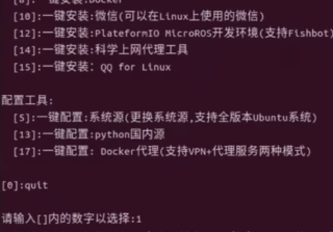

第二步选1，更新系统源再继续安装。

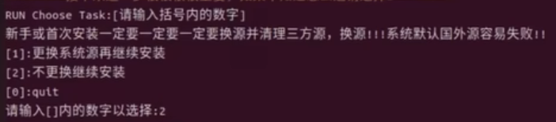

第三步选1，humble。

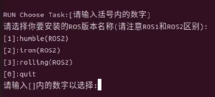


第四步选1，桌面版。

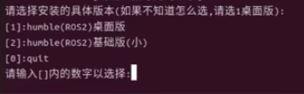

安装完成

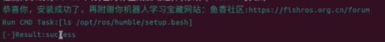

终端中输入ros2,若弹出如下信息，则证明ros2安装成功。

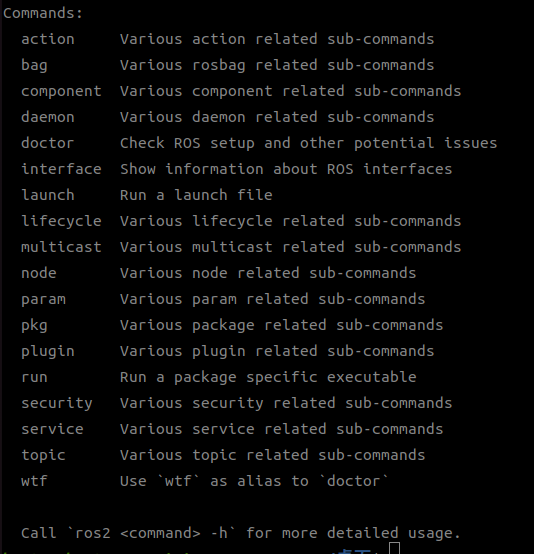

## 1\.2 安装系统依赖

```Python
# 更新系统
sudo apt update -y

# 安装 ROS2 依赖包
sudo apt-get install ros-humble-moveit -y
sudo apt-get install ros-humble-gripper-controllers -y
sudo apt-get install ros-humble-position-controllers -y
sudo apt-get install ros-humble-joint-state-broadcaster -y
sudo apt-get install ros-humble-joint-trajectory-controller -y
sudo apt-get install ros-humble-xacro -y
sudo apt-get install ros-humble-hardware-interface -y
sudo apt-get install ros-humble-controller-manager -y
sudo apt-get install ros-humble-moveit-plugins ros-humble-moveit-ros-perception -y

# 安装 Qt/PySide6 图形界面依赖
sudo apt-get install libxcb-cursor0 libxcb-xinerama0 libxcb-icccm4 libxcb-keysyms1 libxcb-render-util0 -y

# 安装 CAN 和 git
sudo apt-get install can-utils -y
sudo apt-get install git -y

# 安装 vcs 工具
sudo apt-get install python3-vcstool -y

# 安装 Python 依赖
python3 -m pip install python-can -i https://mirrors.tuna.tsinghua.edu.cn/pypi/web/simple
python3 -m pip install pyside6 -i https://mirrors.tuna.tsinghua.edu.cn/pypi/web/simple
python3 -m pip install openarmx_arm_driver -i https://mirrors.tuna.tsinghua.edu.cn/pypi/web/simple
python3 -m pip install placo -i https://pypi.tuna.tsinghua.edu.cn/simple
```

## 1\.3 安装KCAN驱动

①卸载 PCAN 驱动（如未安装过，可跳过此步骤）

```Plaintext
cd peak-linux-driver-8.20.0   # PCAN 驱动目录
sudo modprobe -r pcan
sudo make uninstall
cd
```

**②安装 KCAN 依赖**

```Plaintext
sudo apt update && sudo apt install -y build-essential g++ dkms wget unzip libpopt-dev linux-headers-$(uname -r)
```

**③验证gcc版本（需与内核编译版本一致，查询方法如下）**

```Plaintext
cat /boot/config-$(uname -r) | grep -i "gcc_version"
```

如果输出：CONFIG\_GCC\_VERSION=120300（表示需安装gcc\-12）安装命令如下，如果不是则可跳过这步。

```Plaintext
sudo apt install -y gcc-12
```

**④下载 KCAN 驱动**

```Plaintext
# 下载SDK（最新版本）
wget https://gitee.com/ChengDu-KunHong/KH-UCANFD_Linux_SDK/releases/download/v1.2.2/KH-UCANFD_Linux_SDK.zip

# 解压SDK
unzip KH-UCANFD_Linux_SDK.zip
```

**⑤安装 KCAN 驱动**

```Plaintext
# 进入SDK目录
cd KH-UCANFD_LinuxSDK-v1.2.2/

# 查找并临时禁用这个选项
sudo sed -i 's/-ftrivial-auto-var-init=zero//g' /usr/src/linux-headers-$(uname -r)/Makefile 

# 附权
sudo chmod +x ./build.sh

# 重新编译
./build.sh
```

**⑥编译进入内核**

```Plaintext
sudo mkdir -p /usr/src/kcan-8.20.0/

cat << 'EOF' | sudo tee /usr/src/kcan-8.20.0/dkms.conf
PACKAGE_NAME="kunhong-linux-driver"
PACKAGE_VERSION="8.20.0"
CLEAN="make clean"
MAKE[0]="sed -i 's/-ftrivial-auto-var-init=zero//g' /usr/src/linux-headers-${kernelver}/Makefile 2>/dev/null || true; make DKMS_KERNEL_DIR=$kernel_source_dir MOD=MODVERSIONS PAR=NO_PARPORT_SUBSYSTEM USB=USB_SUPPORT PCI=PCI_SUPPORT PCIEC=PCIEC_SUPPORT ISA=ISA_SUPPORT DNG=NO_DONGLE_SUPPORT PCC=NO_PCCARD_SUPPORT NET=NETDEV_SUPPORT RT=NO_RT"
BUILT_MODULE_NAME[0]="kcan"
BUILT_MODULE_LOCATION[0]="."
DEST_MODULE_LOCATION[0]="/updates"
AUTOINSTALL="yes"
EOF
```

**⑦KCAN 驱动加载验证**

```Plaintext
# 加载kcan驱动模块
sudo modprobe kcan

# 验证驱动是否加载成功（输出含"kcan"即正常）
lsmod | grep kcan
```

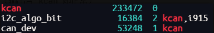

重新拔插 CAN FD 设备后，执行以下命令确认设备被识别：

```Plaintext
# 查看CAN接口信息（输出含"can0"、"can1"等接口即正常）
ip link show
```

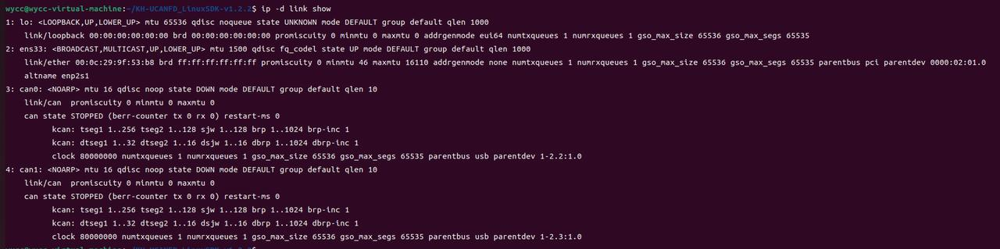

**⑧创建内核更新**

```Plaintext
# 复制驱动源码
sudo cp -r ~/KH-UCANFD_LinuxSDK-v1.2.2/driver/* /usr/src/kcan-8.20.0/

# 创建 DKMS 配置
cat << 'EOF' | sudo tee /usr/src/kcan-8.20.0/dkms.conf
PACKAGE_NAME="kunhong-linux-driver"
PACKAGE_VERSION="8.20.0"
CLEAN="make clean"
# 优化：仅修改当前编译目录的临时Makefile（不改动系统文件），同时指定正确的源码路径
MAKE[0]="cd ${dkms_tree}/${PACKAGE_NAME}/${PACKAGE_VERSION}/source; sed -i 's/-ftrivial-auto-var-init=zero//g' /usr/src/linux-headers-${kernelver}/Makefile 2>/dev/null || true; make DKMS_KERNEL_DIR=${kernel_source_dir} MOD=MODVERSIONS PAR=NO_PARPORT_SUBSYSTEM USB=USB_SUPPORT PCI=PCI_SUPPORT PCIEC=PCIEC_SUPPORT ISA=ISA_SUPPORT DNG=NO_DONGLE_SUPPORT PCC=NO_PCCARD_SUPPORT NET=NETDEV_SUPPORT RT=NO_RT"
BUILT_MODULE_NAME[0]="kcan"
BUILT_MODULE_LOCATION[0]="."
DEST_MODULE_LOCATION[0]="/updates"
AUTOINSTALL="yes"
EOF
# 注册并安装 DKMS
sudo dkms add -m kcan -v 8.20.0
sudo dkms build -m kcan -v 8.20.0
sudo dkms install -m kcan -v 8.20.0
```

输入以下命令进行，验证

```Plaintext
dkms status
```

可看到如下结果，只看到一个也是成功了！

```Plaintext
kcan/8.20.0, 6.8.0-90-generic, x86_64: installed (WARNING! Diff between built and installed module!)
nvidia/580.126.09, 6.8.0-40-generic, x86_64: installed
nvidia/580.126.09, 6.8.0-90-generic, x86_64: installed
```

**⑨开启自启动**

配置

```Plaintext
echo "kcan" | sudo tee /etc/modules-load.d/kcan.conf 
```

检查，输入以下命令查看

```Plaintext
cat /etc/modules-load.d/kcan.conf
```

可看到如下结果

```Plaintext
kcan
```

## 1\.4 构建工作空间

```Plaintext
# 创建工作空间
cd
mkdir -p ~/openarmx_ws/src
cd ~/openarmx_ws/src
```

**拉取代码**

```Plaintext
# 克隆
git clone https://github.com/openarmx/openarmx_ros2.git
# 拉取完整的选项包
vcs import < openarmx_ros2/openarmx.repos
```

**编译**

```Plaintext
# 编译工作空间
cd ~/openarmx_ws
colcon build
```

# 二、电机测试

在Vsode中打开src源代码文件，找到

```Plaintext
openarmx_ws/src/openarmx_motor_manager/GUI_MultiRobot.py
```

运行

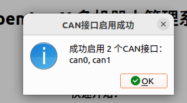


上方选项栏中选择CAN，点击启动CAN（确保CAN线已连接）

上方选项栏中，选择机器人，添加机器人，自动配置。

点击检查点击状态（电机要给电才能检测到）

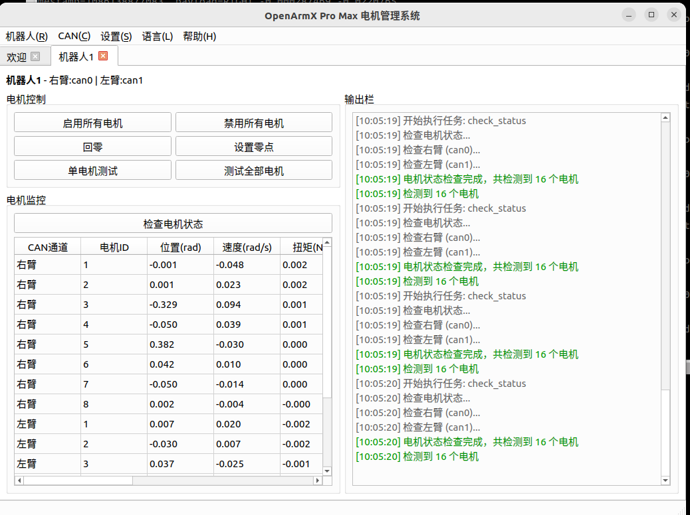

之后可以点击测试全部电机，可以看到16个电机依次小范围转动。


# 三、 MoveIt测试

此步骤用于验证 ROS 2 \+ MoveIt 的基础运动规划链路是否可用，包括：

- 机器人模型（URDF / SRDF）是否正确

- 规划器是否能够生成一条可执行的关节轨迹

- 规划结果是否能够正确下发并驱动机器人运动

**注意：每次电机上电之前都需要启动CAN**


## 3\.1启动 MoveIt

```Plain Text
cd openarmx_ws
source install/setup.bash
ros2 launch openarmx_bimanual_moveit_config demo.launch.py 

cd openarmx_ws
source install/setup.bash
/home/huatec/openarmx_ws/src/openarmx_ros2/openarmx_bimanual_moveit_config/run_bimanual_moveit_with_can2.0.sh

```

可以看到如下图，拖动moveit球。

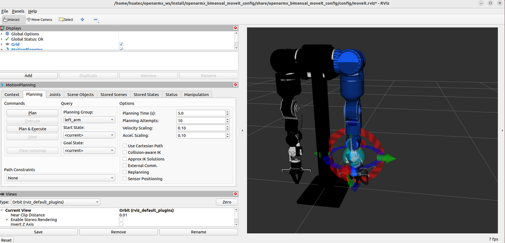

点击plan可以看到机械臂运动轨迹，电机plan\&execute可以看到真实机械臂运动。

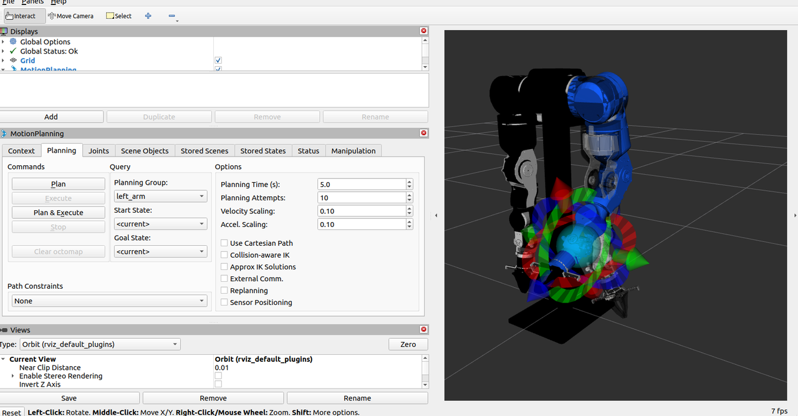


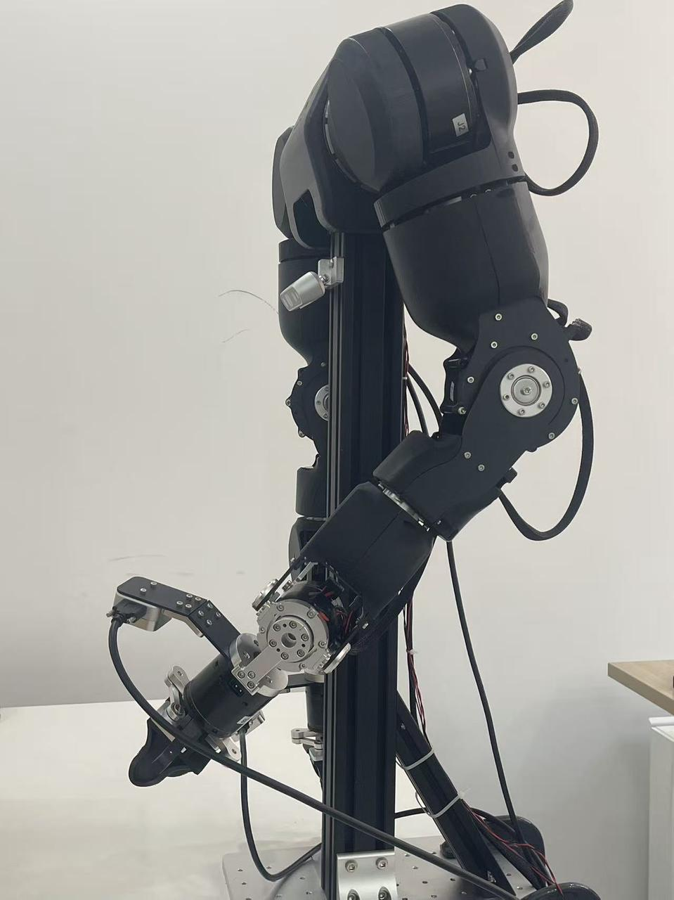

# 四、VR遥操作

## 4\.1 设备清单

- `1 x` Pico 4 Ultra

- `1 x` OpenArmX Pro Max 机器人

- `1 x` USB Type\-C 数据线（用于安装 APK）

- `1 x` 同局域网 Wi\-Fi（用于 VR 与 PC 通信）

## 4\.2 映射方式说明

本系统采用**相对运动映射**，而不是“手柄绝对位姿 = 机器人绝对位姿”。

- 机器人不会瞬间跳到手柄当前绝对位置。

- 建议开始精细操作前，先将手柄移动到与机器人当前姿态大致一致的位置。

- 该设计可减少大幅跳变和误操作风险，长时间遥操更稳定。

## 4\.3 Pico安装桥接软件

①连接设备

1. 开启开发者模式并进入 USB 调试模式。
开启开发者模式：`设置 > 关于本机 > 连续点击软件版本号`
开启 USB 调试：`设置 > 开发者选项 > USB 调试`

2. 使用 USB Type\-C 数据线将 Pico 连接到 PC。

2. 安装 Pico 桥接 APK

②下载 Pico 桥接 apk

```Plaintext
cd ~/openarmx_ws/src
git clone https://github.com/openarmx/openarmx_pico_apk.git
```

```Plaintext
# 安装 ADB 工具
sudo apt install adb

# 进入 APK 所在目录
cd ~/openarmx_ws/src/openarmx_pico_apk

# 安装桥接软件
adb install OpenArmX_Pico-release.apk
```

## 4\.4 启动 VR 遥操

先启动机器人，再启动桥接节点，最后启动 VR 遥操节点。

### 步骤1：启动从动端机器人

**仿真模式**

```Plaintext
cd openarmx_ws
source install/setup.bash

ros2 launch openarmx_bringup openarmx.bimanual.launch.py \
  control_mode:=mit \
  robot_controller:=forward_position_controller \
  use_fake_hardware:=true \
  auto_raise_arms:=true
```

**真机模式**\(启动之前需要启动CAN口，电机GUI\)

```Plaintext
# 配置双臂 CAN 接口
sudo ip link set can0 down
sudo ip link set can0 type can bitrate 1000000
sudo ip link set can0 up

sudo ip link set can1 down
sudo ip link set can1 type can bitrate 1000000
sudo ip link set can1 up

cd openarmx_ws
source install/setup.bash

ros2 launch openarmx_bringup openarmx.bimanual.launch.py \
    control_mode:=mit \
    robot_controller:=forward_position_controller \
    use_fake_hardware:=false \

```


### 步骤2：启动 Pico 桥接节点

```Plaintext
cd openarmx_ws
source install/setup.bash

ros2 run openarmx_teleop_bridge_vr_pico openarmx_teleop_bridge_vr_pico_node
```

### 步骤 3：启动 VR 遥操节点

```Plaintext
cd openarmx_ws
source install/setup.bash


ros2 launch openarmx_teleop_vr_pico teleop_vr_pico.launch.py
```

换一种解算方式link为 约束第二第四关节

```Plain Text
cd openarmx_ws
source install/setup.bash

ros2 launch openarmx_teleop_vr_pico teleop_vr_pico.launch.py \
  constraint_mode:=link
```

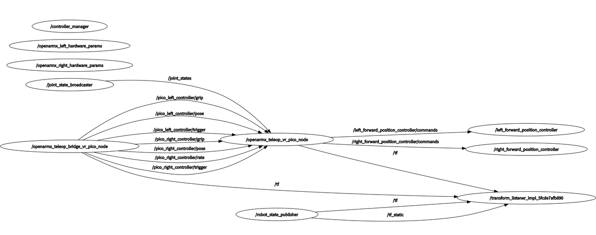


# 五、VLA

- 1 台 OpenArmX 双臂机器人

- 2 个 RealSense D405（左右手）

- 1 个 RealSense D435（头部）

- 1 台 遥操设备：Pico4 Ultra（VR 遥操作）

## 5\.1 安装环境

**①安装 Anaconda**

```Plaintext
cd ~
wget https://repo.anaconda.com/archive/Anaconda3-2023.03-1-Linux-x86_64.sh
bash Anaconda3-2023.03-1-Linux-x86_64.sh
source ~/.bashrc
```

**② 关闭 base 自动激活并设置快捷命令**

```Plaintext
conda deactivate
conda config --set auto_activate_base false
conda deactivate

sed -i '/# >>> conda initialize >>>/,/# <<< conda initialize <<</ s/^/#/' ~/.bashrc

echo '' >> ~/.bashrc
echo '# Anaconda 快捷命令（手动激活）' >> ~/.bashrc
echo "alias conda-init='source ~/anaconda3/bin/activate'" >> ~/.bashrc
echo "alias lerobot-env='source ~/anaconda3/bin/activate lerobot'" >> ~/.bashrc
source ~/.bashrc
```

**③创建环境**

```Plaintext
conda-init
conda create -n lerobot python=3.10 -y
conda deactivate
```

**④系统依赖 \+ RealSense**

```Plaintext
sudo apt update
sudo apt install -y \
  python3-dev build-essential git git-lfs \
  ffmpeg libavcodec-dev libavformat-dev libavutil-dev \
  libjpeg-dev libpng-dev libgl1-mesa-glx libglib2.0-0 \
  libsm6 libxext6 libsndfile1 libsvtav1-dev

sudo mkdir -p /etc/apt/keyrings
curl -sSf https://librealsense.intel.com/Debian/librealsense.pgp | sudo tee /etc/apt/keyrings/librealsense.pgp > /dev/null

echo "deb [signed-by=/etc/apt/keyrings/librealsense.pgp] https://librealsense.intel.com/Debian/apt-repo $(lsb_release -cs) main" | sudo tee /etc/apt/sources.list.d/librealsense.list

sudo apt install -y librealsense2-dkms librealsense2-utils librealsense2-dev
sudo apt install -y ros-humble-realsense2-camera
```

**⑤按照python依赖**

```Plaintext
# 激活lerobot虚拟环境
lerobot-env

# 安装依赖
pip install pyrealsense2 -i https://pypi.tuna.tsinghua.edu.cn/simple/
pip install "scipy>=1.10.1,<1.15" -i https://pypi.tuna.tsinghua.edu.cn/simple/
pip install torch torchvision torchaudio -i https://pypi.tuna.tsinghua.edu.cn/simple/
pip install 'numpy>=1.21,<2.0' -i https://mirrors.aliyun.com/pypi/simple/
pip install 'setuptools>=71.0.0,<80.0.0' -i https://mirrors.aliyun.com/pypi/simple/
pip install pillow imageio matplotlib pyyaml -i https://mirrors.aliyun.com/pypi/simple/
```

**⑥安装 LeRobot**

```Plaintext
lerobot-env
pip install lerobot -i https://mirrors.aliyun.com/pypi/simple/
```

验证是否成功

```Plaintext
python -c "import lerobot; print(lerobot.__version__)" 
```

预期输出包含版本号，例如 `0.4.3`。

**⑦安装 OpenArmX 本地插件包**

```Plaintext
lerobot-env

cd ~/openarmx_ws/src/openarmx_vla/lerobot_robot_openarmx_follower_ros2
pip install -e . --no-deps
cd ~/openarmx_ws/src/openarmx_vla/lerobot_teleoperator_openarmx_leader_ros2
pip install -e . --no-deps
```

## 5\.2采集数据\(VR\)

### 采集端

**终端 1：启动双臂机器人**

```Plaintext
cd ~/openarmx_ws/
source install/setup.bash
ros2 launch openarmx_bringup openarmx.bimanual.launch.py \
  control_mode:=mit \
  robot_controller:=forward_position_controller \
  use_fake_hardware:=false
```

**终端 2：启动 Pico 桥接**

```Plaintext
cd ~/openarmx_ws/
source install/setup.bash
ros2 run openarmx_teleop_bridge_vr_pico openarmx_teleop_bridge_vr_pico_node
```

**终端 3：启动 IK 逆解**

```Plaintext
cd ~/openarmx_ws/
source install/setup.bash
ros2 launch openarmx_teleop_vr_pico teleop_vr_pico.launch.py
```

**终端 4：启动相机发布**

```Plaintext
cd ~/openarmx_ws/
source install/setup.bash
ros2 launch openarmx_lerobot camera_publisher.launch.py \
  width:=424 height:=240 fps:=30 \
  cam_left_serial:=序列号 cam_left_type:=型号 \
  cam_right_serial:=序列号 cam_right_type:=型号 \
  cam_head_serial:=序列号 cam_head_type:=型号
```

示例：（序列号需要查询）终端中输入：rs\-enumerate\-devices

```Plaintext
cd ~/openarmx_ws/
source install/setup.bash
ros2 launch openarmx_lerobot camera_publisher.launch.py \
  width:=424 height:=240 fps:=30 \
  cam_left_serial:=409122273752 cam_left_type:=D405 \
  cam_right_serial:=409122272398 cam_right_type:=D405 \
  cam_head_serial:=243222074552 cam_head_type:=D435I
```

### 接收端\(lerobot\)

**5\. 终端 5：启动 LeRobot 采集**

```Plaintext
lerobot-env

HF_HUB_OFFLINE=1 lerobot-record \
  --robot.type=openarmx_follower_ros2 \
  --teleop.type=openarmx_leader_ros2 \
  --dataset.repo_id=local/你的数据名称 \
  --dataset.single_task="任务名称" \
  --dataset.num_episodes=采集的总组数 \
  --dataset.episode_time_s=每组时长秒数 \
  --dataset.reset_time_s=组间重置时长秒数 \
  --dataset.push_to_hub=false \
  --display_data=true
```

实例：

```Plaintext
lerobot-env
HF_HUB_OFFLINE=1 lerobot-record \
      --robot.type=openarmx_follower_ros2 \
      --teleop.type=openarmx_leader_ros2 \
      --dataset.repo_id=local/openarmx_dataset_sim_to_real \
      --dataset.single_task="palce the green cube on the box" \
      --dataset.num_episodes=10 \
      --dataset.episode_time_s=9999 \
      --dataset.reset_time_s=15 \
      --dataset.push_to_hub=false \
      --display_data=true \
      --dataset.vcodec=h264
      # 编码器名称['h264', 'hevc', 'libsvtav1']
```

- `→`：结束并保存当前 episode

- `←`：丢弃当前 episode

- `Esc`：停止录制并退出

### **播放录制的数据集**

episode\-index是第几个数据

```Plaintext
lerobot-env
HF_HUB_OFFLINE=1 lerobot-dataset-viz \
  --repo-id local/openarmx_dataset \
  --root /home/huatec/.cache/huggingface/lerobot/local/openarmx_dataset_backup \
  --mode local \
  --episode-index 0 \
  --display-compressed-images false
```

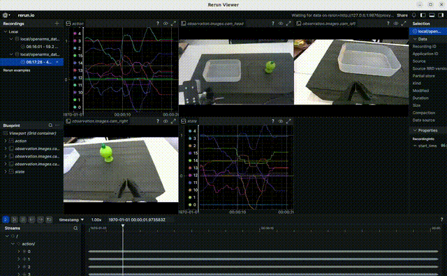

如下代码可以查看任务名称

```Python
python - <<'PY'
import pandas as pd
print("=== tasks ===")
print(pd.read_parquet("meta/tasks.parquet"))
PY
```

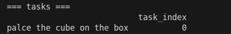

## 5\.3 训练

### **模型下载**

**ACT**

```Plaintext
mkdir -p ~/.cache/torch/hub/checkpoints
wget https://download.pytorch.org/models/resnet18-f37072fd.pth -O ~/.cache/torch/hub/checkpoints/resnet18-f37072fd.pth
```

**SmolVLA**

```Plaintext
mkdir -p ~/.cache/huggingface/hub/models--lerobot--smolvla_base
mkdir -p ~/.cache/huggingface/hub/models--HuggingFaceTB--SmolVLM2-500M-Video-Instruct

cp -r "/media/openarm/新加卷/weilindong/888/训练模型/smolvla_base"/* \
  ~/.cache/huggingface/hub/models--lerobot--smolvla_base/

cp -r "/media/openarm/新加卷/weilindong/888/训练模型/smolvla_模型依赖/SmolVLM2-500M-Video-Instruct"/* \
  ~/.cache/huggingface/hub/models--HuggingFaceTB--SmolVLM2-500M-Video-Instruct/

lerobot-env
pip install 'transformers>=4.57.1' 'num2words>=0.5.14' 'accelerate>=1.7.0' 'safetensors>=0.4.3' 
```

若transformers 和lerobot存在依赖冲突，可以换成如下安装。

```Plaintext
pip install "huggingface-hub==0.35.3"   -i https://mirrors.aliyun.com/pypi/simple/
pip install "transformers==4.56.2" "num2words>=0.5.14" "accelerate>=1.7.0" "safetensors>=0.4.3"   -i https://mirrors.aliyun.com/pypi/simple/
```

运行如下代码，若正常打印，不出现报错，则证明环境依赖安装正确。

```Plaintext
lerobot-train --help
```

### 单卡训练

通用前置（禁止HF联网）

```Plaintext
lerobot-env
export HF_HUB_OFFLINE=1
export TRANSFORMERS_OFFLINE=1
```

ACT

```Plaintext
lerobot-train \
  --dataset.repo_id=local/你的数据名称 \
  --dataset.root=你的数据绝对路径 \
  --policy.type=act \
  --policy.push_to_hub=false \
  --output_dir=outputs/训练好的模型名字 \
  --batch_size=每个训练步的批次大小 \
  --steps=总训练步数 \
  --log_freq=每隔多少步输出一次日志 \
  --save_freq=每隔多少步保存一次
```

SmolVLA

```Plaintext
lerobot-train \
  --dataset.repo_id=local/你的数据名称 \
  --dataset.root=你的数据绝对路径 \
  --dataset.video_backend=pyav \
  --policy.type=smolvla \
  --policy.path=lerobot/smolvla_base \
  --batch_size=每个训练步的批次大小 \
  --steps=总训练步数 \ #20k最低 
  --output_dir=outputs/训练好的模型名字 \
  --wandb.enable=false \
  --log_freq=每隔多少步输出一次日志 \
  --save_freq=每隔多少步保存一次
```

示例：

```Plaintext
lerobot-env
lerobot-train \
  --dataset.repo_id=local/openarmx_dataset \
  --dataset.root=/home/huatec/.cache/huggingface/lerobot/local/openarmx_dataset \
  --dataset.video_backend=pyav \
  --policy.type=smolvla \
  --policy.pretrained_path=/home/huatec/models/smolvla_base \
  --policy.vlm_model_name=/home/huatec/models/SmolVLM2-500M-Video-Instruct \
  --policy.push_to_hub=false \
  --batch_size=16 \
  --steps=30000 \
  --output_dir=/home/huatec/outputs/smolvla_openarmx_output \
  --wandb.enable=true \
  --log_freq=50 \
  --save_freq=5000
```

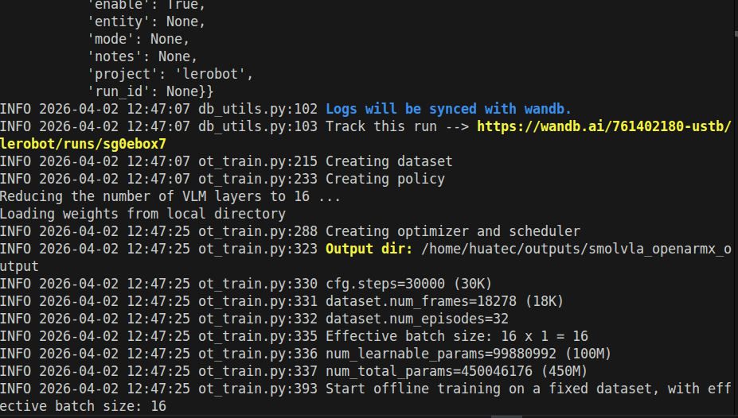


如下为训练过程中损失曲线等图像。

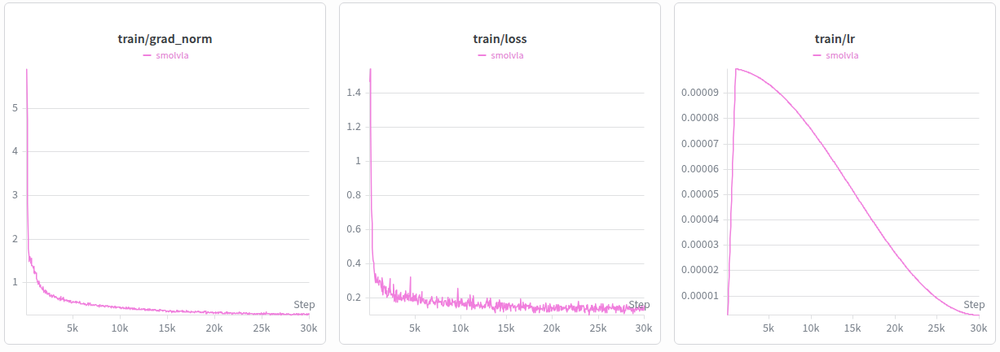

如下为训练过程中GPU显存使用量和训练时间等图像。

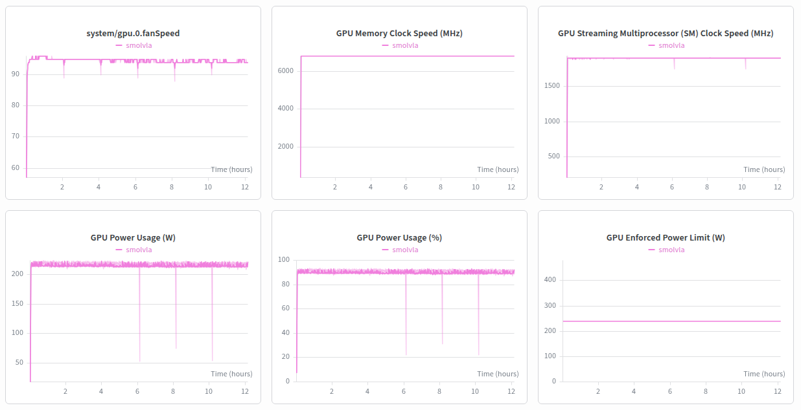

## 5\.4 推理

### 终端 1：启动双臂机器人

```Plaintext
cd openarmx_ws
source install/setup.bash

ros2 launch openarmx_bringup openarmx.bimanual.launch.py \
    control_mode:=mit \
    robot_controller:=forward_position_controller \
    use_fake_hardware:=false
```

### 终端 2：启动摄像头

```Go
cd ~/openarmx_ws/
source install/setup.bash
ros2 launch openarmx_lerobot camera_publisher.launch.py \
  width:=424 height:=240 fps:=30 \
  cam_left_serial:=409122273752 cam_left_type:=D405 \
  cam_right_serial:=409122272398 cam_right_type:=D405 \
  cam_head_serial:=243222074552 cam_head_type:=D435I
```

### 终端 3：启动推理

```Plaintext
lerobot-env

HF_HUB_OFFLINE=1 lerobot-record \
      --robot.type=openarmx_follower_ros2 \
      --robot.skip_send_action=false \
      --dataset.repo_id=local/eval_你的推理结果名称 \
      --dataset.single_task="你的任务名称" \
      --dataset.num_episodes=推理的总次数 \
      --dataset.push_to_hub=false \
      --display_data=true \
      --policy.path="你的预训练模型文件夹(pretrained_model)的路径"
```

```Plain Text
lerobot-env
HF_HUB_OFFLINE=1 lerobot-record \
  --robot.type=openarmx_follower_ros2 \
  --robot.skip_send_action=false \
  --dataset.repo_id=local/eval_smolvla_openarmx_output \
  --dataset.single_task="palce the green cube on the box" \
  --dataset.num_episodes=1 \
  --dataset.episode_time_s=999 \
  --dataset.reset_time_s=10 \
  --dataset.push_to_hub=false \
  --display_data=true \
  --policy.type=smolvla \
  --policy.pretrained_path="/home/huatec/outputs/smolvla_openarmx_output/checkpoints/030000/pretrained_model" \
  --policy.device=cuda
```


# 六、一键启动


## 终端一：数据采集端

内含四个终端

```Plain Text
cd ~/openarmx_ws
bash start_collect_terminator.sh
```

每次运行完之后，需要ctrl\+c中断每一个中断（或断电），否则第二次启动，电机会突然复位，造成不必要的后果。

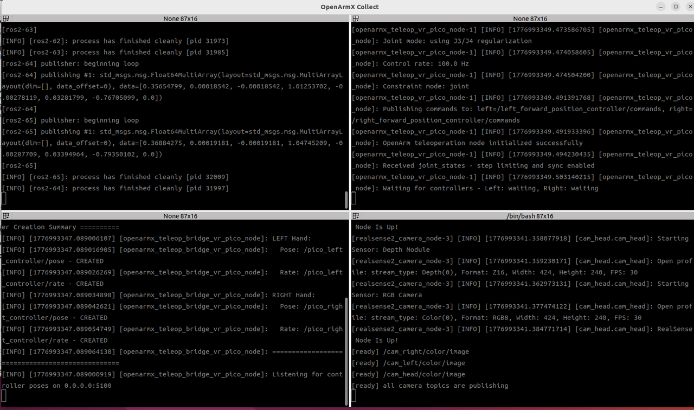

## 终端二：数据接受端lerobot

```Plain Text
lerobot-env
HF_HUB_OFFLINE=1 lerobot-record \
      --robot.type=openarmx_follower_ros2 \
      --teleop.type=openarmx_leader_ros2 \
      --dataset.repo_id=local/openarmx_dataset \
      --dataset.single_task="palce the green cube on the box" \
      --dataset.num_episodes=50 \
      --dataset.episode_time_s=9999 \
      --dataset.reset_time_s=15 \
      --dataset.push_to_hub=false \
      --display_data=true \
      --dataset.vcodec=h264
      # 编码器名称['h264', 'hevc', 'libsvtav1']
```


